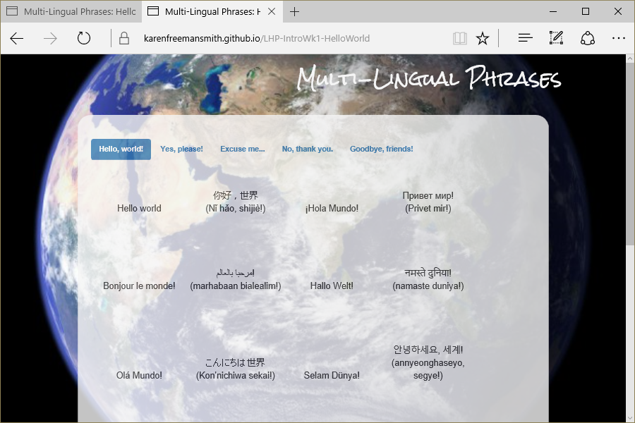

# Hello World
Version 0.1.0: June 4, 2016
by [Karen Freeman-Smith](https://karenfreemansmith.github.io)

## Technologies Used
HTML, Git, Github, CSS, Bootstrap, JavaScript, jQuery, API/JSON

## Description
Learn How to Program Intro to Programming Week 1 Independent Project: Build hello world website to learn fundamentals of HTML and how to use Git & Github.
* Version 0.0.2 - Extended to use CSS/Bootstrap for styling.
* Version 0.0.3 - Extended to use JavaScript & jQuery for flashcard function.
* Version 0.1.0 - Extended to consume JSON file to get language data.

## Setup/Installation
* [View on Github Pages](https://karenfreemansmith.github.io/LHP-IntroWk1-HelloWorld)

 __OR__
* Clone project to your computer
* Place project in a directory with a working web server (*API won't work without it!*)
* Navigate to index.html in your favorite browser

## Support & Contact
For questions, concerns, or suggestions please email karenfreemansmith@gmail.com

## Known Issues
* None

## Legal
* Licensed under the GNU General Public License v3.0

Copyright (c) 2016 Copyright _[Karen Freeman-Smith](https://karenfreemansmith.github.io)_ All Rights Reserved.
